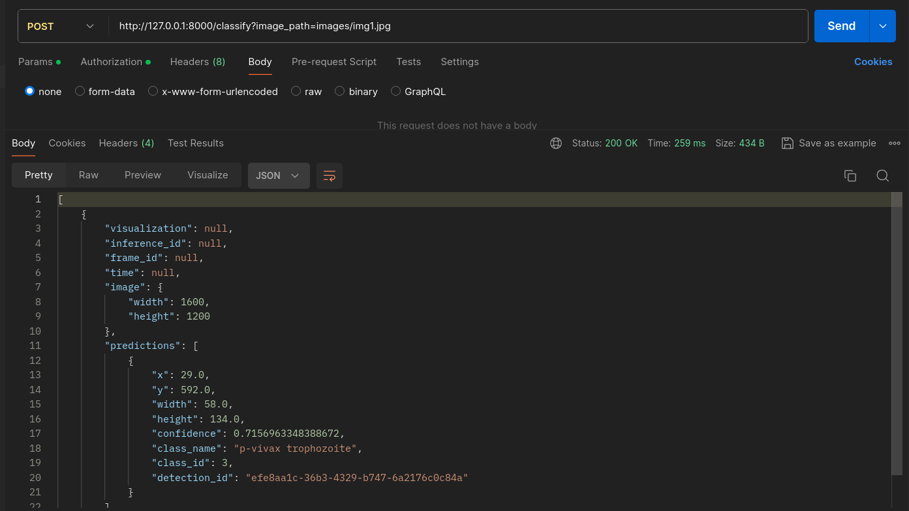

## How to Run
 - Docker installed
 - Create a `.env` file in root directory, with: 
 
   `export ROBOFLOW_API_KEY="your_roboflow_api_key"`
 - in root direcory, run the command:
  ```bash
    docker-compose build
  ```
  and
  ```bash
    docker-compose up
  ```
  - to verify, in postman send a POST request in URL: ` "http://127.0.0.1:8000/classify?image_path=images/img1.jpg"`
  
  
    Response:
    